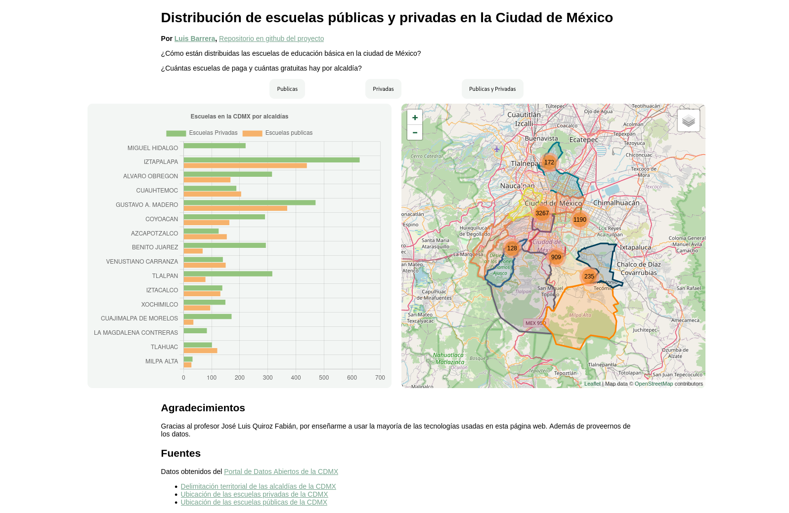
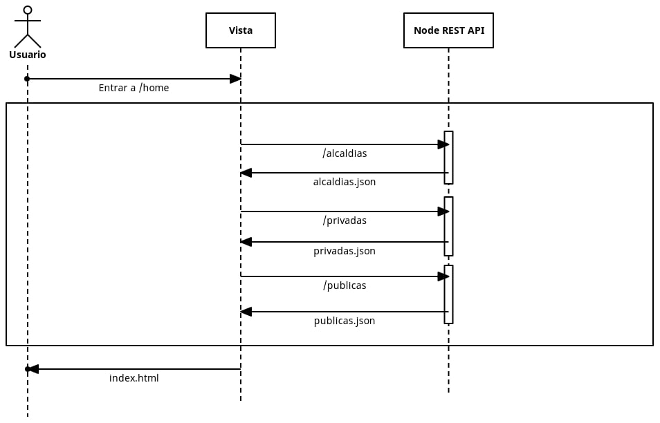

# Escuelas de la CDMX

---

[Live Demo en Vercel](https://escuelas-cdmx-vite.vercel.app/)

Una página web que muestra las escuelas públicas y privadas de la Ciudad de México en un mapa, separadas por alcaldías.

Además de un gráfico que muestra la cantidad de escuelas de cada tipo por alcaldías.

Con los botones podemos filtrar el tipo de escuela que queremos mostrar tanto en el gráfico como en el mapa.

Podemos acercarnos en el mapa y dar click a los marcadores y se mostrará la información de la escuela.

## Arquitectura

La página está construida en JavaScript sobre Node.js.
Consta de una única página web en `/home`.
Cuando se encuentra a esta dirección se el controlador se encarga de hacer 3 request al servidor donde está el servidor, que le se devuelven un JSON que será usado para construir la vista correspondiente.
Estos servicios son 3:

- `/alcaldias`, con las coordenadas para dibujar un polígono.
- `/privadas`, con la información de las escuelas privadas.
- `/publicas`, con la información de las escuelas publicas.

## Tecnologías usadas

Aparte de las tecnologías web básicas (HTML, CSS y JS), se usó:

- [Node js](https://nodejs.org/en/)
- [Leaflet](https://leafletjs.com/), para el mapa interactivo.
- [MarkerCluster](http://leaflet.github.io/Leaflet.markercluster/), para el agrupamiento de los marcadores en el mapa.
- [Chart.js](https://www.chartjs.org/), para la creación del gráfico de barras.
- [Express](http://expressjs.com/), para la creación de la página web y las APIs en Node.js.
